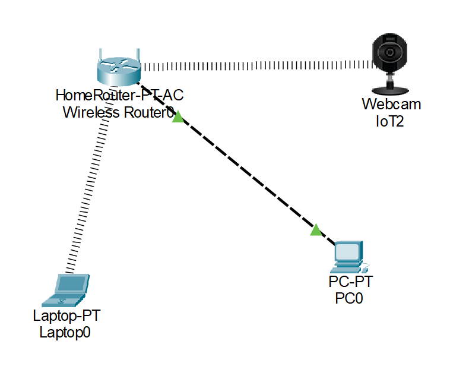
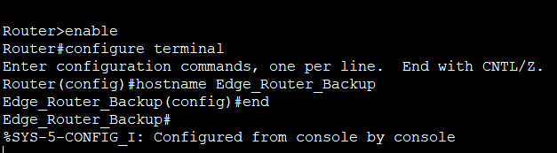
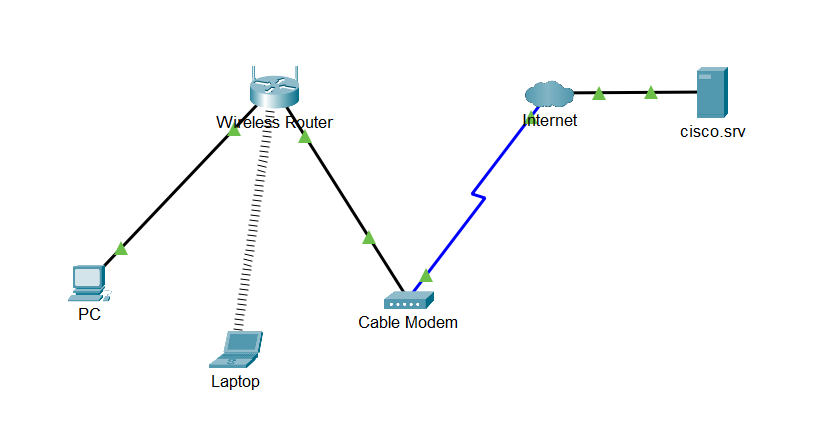

[Link to main page](../index.md).

# Cisco Packet Tracer Introductory Course

This project documents my experience performing the [Cisco Packet Tracer](https://www.netacad.com/learning-collections/cisco-packet-tracer?courseLang=en-US) learning collection. This learning collection teaches how to utilize Cisco Packet Tracer, a powerful network visualization tool. This course consist of multiple labs which illustrate Cisco Packet Tracer's network simulation features.

## Getting Started With Cisco Packet Tracer

> This is the first part of the learning collection. It describes what Cisco Packet Tracer is, how the application is layed out, and how to use its basic features like placing and interacting with network components.

- Lab: Home Network Test
  - After downloading and installing Cisco Packet Tracer, I am taught how to set up a basic home network.
  - I place a home router, PC, laptop, and microphone into the simulated environment.
  - I connect the router to the PC with a wired connection and set the laptop to be wireless. It connects automatically.
  - I set the SSID on the microphone to match the router, allowing it to connect wirelessly.

- Lab: Logical and Physical Mode Exploration
  - This lab explains the difference between logical and physical mode in the app.
  - Logical mode displays the flow of data within the network, using devices as anchor points.
  - Physical mode displays the arrangement of devices and cables within a space.
  - The lab comes with an prebuilt intercity network, and focuses on physical mode.
  - In the office, I connect a PC to the ethernet and edge router. I then install a second router and connect it to a laptop.
  - Using the laptop, I access the second router and use console commands to change its settings.

  
- Lab: Build a Home Network
  - In this lab, I establish a home network and connect it to the internet.
  - I place a laptop, PC, and modem into an environment which already contains a router and internet connection.
  - Using cables, I connectthe PC to the wireless router, the router to the modem, and the modem to the internet.
  - Utilizing physical mode, I switch the laptop to be wireless, allowing to to connect to the router.
  - To confirm a connection, I use the virtual web browser on the laptop.

## Exploring Networking With Cisco Packet Tracer

> This portion of the learning collection focuses on how to connect and manage devices within the virtual network. It has an emphasis on using some devices to manage others, like using a tablet or desktop to change settings on a router.

- level 1 item
  - level 2 item
  - level 2 item
    - level 3 item
    - level 3 item
- level 1 item
  - level 2 item
  - level 2 item
  - level 2 item
- level 1 item
  - level 2 item
  - level 2 item
- level 1 item

## Exploring Internet of Things With Cisco Packet Tracer

> This is the last part of the learning collection. It describes Cisco Packet Tracer's ability to create and edit network components which represent various smart objects.

- level 1 item
  - level 2 item
  - level 2 item
    - level 3 item
    - level 3 item
- level 1 item
  - level 2 item
  - level 2 item
  - level 2 item
- level 1 item
  - level 2 item
  - level 2 item
- level 1 item

