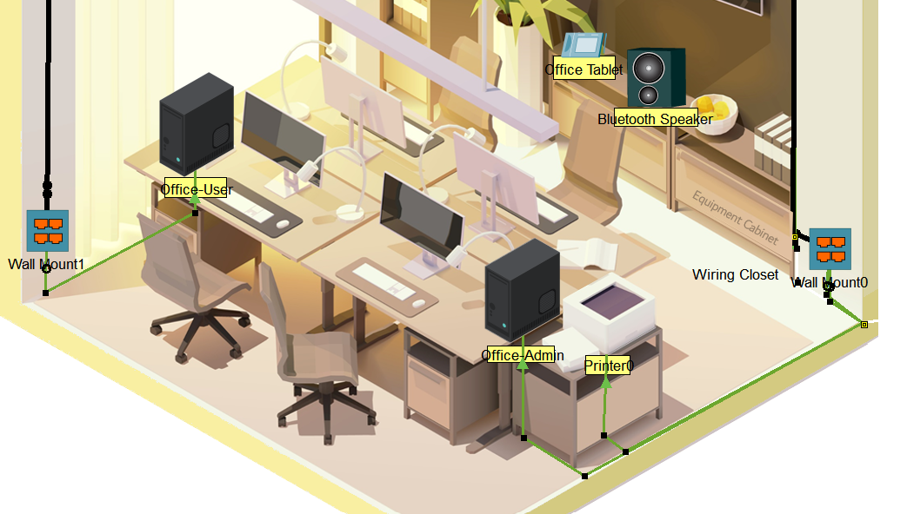
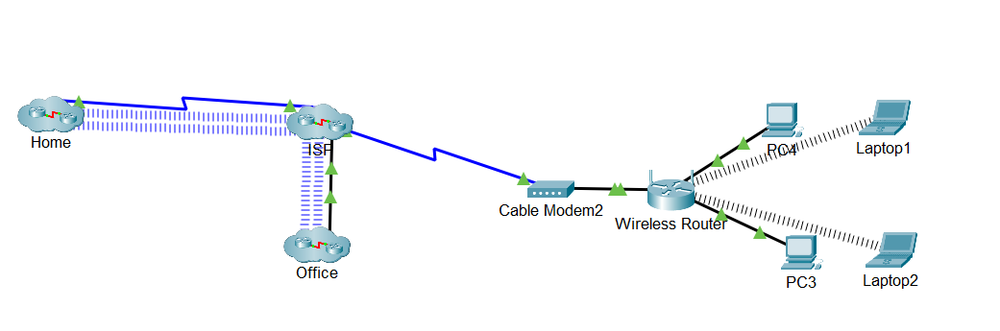
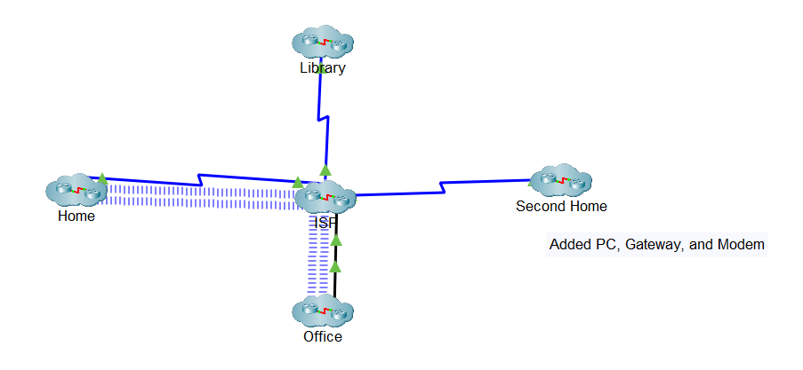
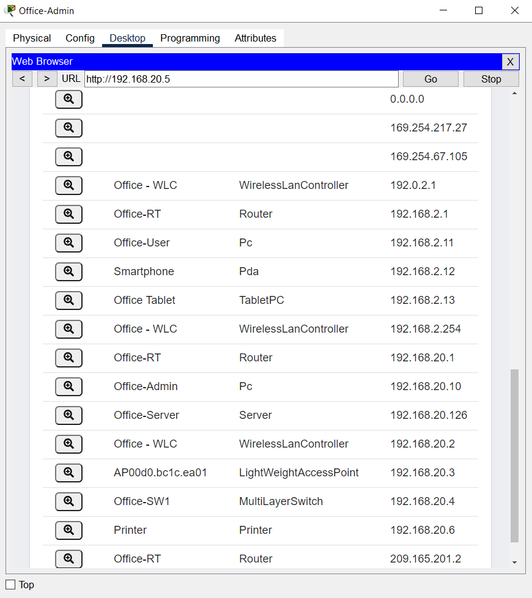

[Link to main page](../index.md).

# Cisco Packet Tracer Introductory Course

This project documents my experience performing the [Cisco Packet Tracer](https://www.netacad.com/learning-collections/cisco-packet-tracer?courseLang=en-US) learning collection. This learning collection teaches how to utilize Cisco Packet Tracer, a powerful network visualization tool. This course consist of multiple labs which illustrate Cisco Packet Tracer's network simulation features.

## Getting Started With Cisco Packet Tracer

> This is the first part of the learning collection. It describes what Cisco Packet Tracer is, how the application is layed out, and how to use its basic features like placing and interacting with network components.

- Lab: Home Network Test
  - After downloading and installing Cisco Packet Tracer, I am taught how to set up a basic home network.
  - I place a home router, PC, laptop, and microphone into the simulated environment.
  - I connect the router to the PC with a wired connection and set the laptop to be wireless. It connects automatically.
  - I set the SSID on the microphone to match the router, allowing it to connect wirelessly.

- Lab: Logical and Physical Mode Exploration
  - This lab explains the difference between logical and physical mode in the app.
  - Logical mode displays the flow of data within the network, using devices as anchor points.
  - Physical mode displays the arrangement of devices and cables within a space.
  - The lab comes with an prebuilt intercity network, and focuses on physical mode.
  - In the office, I connect a PC to the ethernet and edge router. I then install a second router and connect it to a laptop.
  - Using the laptop, I access the second router and use console commands to change its settings.

  
- Lab: Build a Home Network
  - In this lab, I establish a home network and connect it to the internet.
  - I place a laptop, PC, and modem into an environment which already contains a router and internet connection.
  - Using cables, I connectthe PC to the wireless router, the router to the modem, and the modem to the internet.
  - Utilizing physical mode, I switch the laptop to be wireless, allowing to to connect to the router.
  - To confirm a connection, I use the virtual web browser on the laptop.

## Exploring Networking With Cisco Packet Tracer

> This portion of the learning collection focuses on how to connect and manage devices within the virtual network. It has an emphasis on using some devices to manage others, like using a tablet or desktop to change settings on a router.

- Lab: Cable Structuring
  - This lab focuses on managing cables in physical mode.
  - First, I install a patch panel in the lab's wiring closet. Using cables, I attach it to the switch.
  - In the office, I add a wall mount and link it to the patch panel, PC, and printer.
  - I use a second patch panel and connect a second PC to it.
  - Bendpoints are used to organize cables to the office's corners.

- Lab: Wireless Devices
  - I swap a laptop to wireless mode and use the PC's wireless tool to connect on the WLAN.
  - I enable bluetooth on a speaker and connect it to the office tablet.
  - I enable bluetooth on a phone. I bluetooth pair and tether it to the previously mentioned laptop.

- Lab: Device Configuration with Console
  - Using a laptop terminal, I access a switch. I use commands to change its name and password settings.
  - In order to make these changes permanent, I save them as the boot settings. They are now the default when the switch is turned on.

- Lab: Examining Packets
  - I use Cisco Packet Tracer to create a simple ping between two devices.
  - Using the simulation panel, I view the ping's results.
  - I create a complex ping with manual parameters. The ping will occur every 5 seconds.
  - I view the new ping in the simulation panel.

- Lab: Editing Topologies
  - This lab consists of multiple clusters of devices.
  - In the office cluster, I connect a PC to a wall mount, that wall mount to a patch panel, and that patch panel to a switch.
  - I ping the remote server with the PC to confirm network connectivity.
  - Zooming out from the office, I view the multiple clusters in the Lab. The lab has me uncluster and recluster one of them.
  - The lab has me create a small group of devices and connect them together. I cluster the group into one item in the logical view.
  - I connect the new cluster's modem to the ISP server.

- Lab: Network Controller
  - I install a network controller onto the device rack and connect it to a switch.
  - I ping the network controller from a PC to check its connectivity, then log into its web application.
  - After viewing the currently managed network devices, I add multiple new devices to the network.
  - I return to the network controller's web application and discover the new devices.

- Lab: Network Troubleshooting
  - In this lab, a PC has been failing to connect to the network.
  - I attempt to connect to the network from all PCs and discover the one which isn't connecting.
  - Using an ipconfig command from a working PC, I retrieve the network router's IP address.
  - I log into the router's web app from a working PC and retrieve its password.
  - I connect to the router with the problem PC, allowing it to connect to the network.

## Exploring Internet of Things With Cisco Packet Tracer

> This is the last part of the learning collection. It describes Cisco Packet Tracer's ability to create and edit network components which represent various smart objects.

- level 1 item
  - level 2 item
  - level 2 item
    - level 3 item
    - level 3 item
- level 1 item
  - level 2 item
  - level 2 item
  - level 2 item
- level 1 item
  - level 2 item
  - level 2 item
- level 1 item

