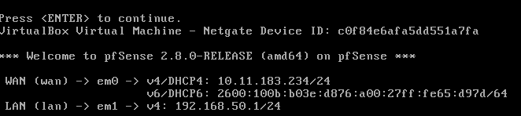
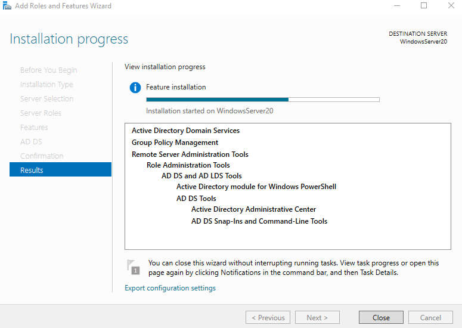
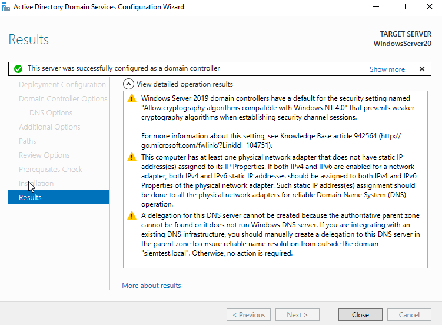
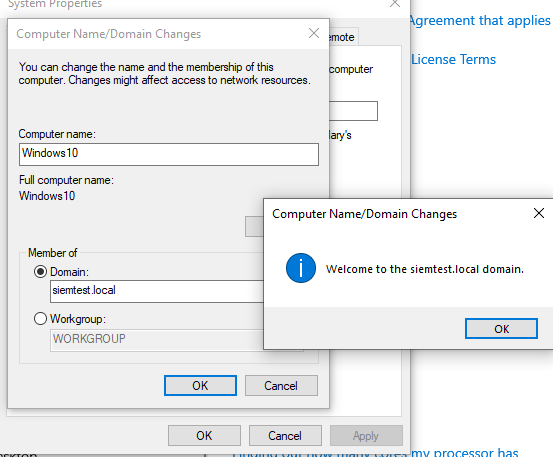
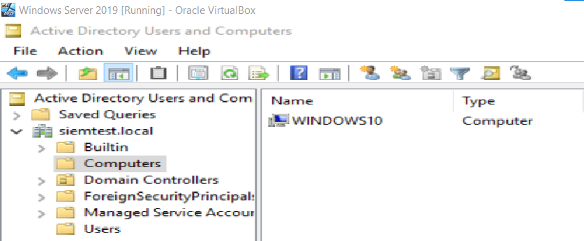
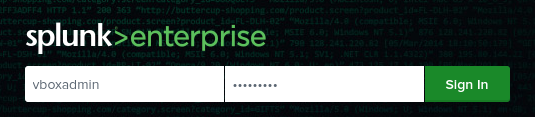
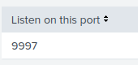
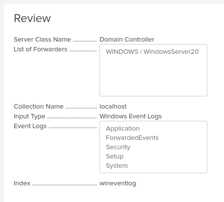
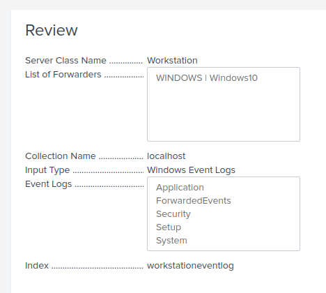

<a href="https://coldtest-0.github.io/Cybersecurity-Portfolio/">Main Page</a>
 | <a href="https://coldtest-0.github.io/Cybersecurity-Portfolio/ProjectPage">Projects Page</a>
 | <a href="https://coldtest-0.github.io/Cybersecurity-Portfolio/ContactPage">Contact Page</a>

# SIEM Home Lab Project

This project documents my experience performing the [SIEM Home Lab](https://medium.com/@aw23/siem-homelab-part-1-c6392b9957d7) overview on Medium.com. This learning collection teaches how to make a small SIEM network in Oracle VirtualBox, a powerful network virtualization tool.

## Part 1: Setup

 This part consist of multiple steps which set up each part of the network.
 
- Task 1: PfSense Setup
  - I download an iso image of PfSense from its official website.
  - In VirtualBox, I open the PfSense iso as a new system.
  - The new firewall is configured to have adapter 1 be a bridged WAN connection. Adapter 2 is a LAN connection.
  - Starting the new system, I complete initial installation.
  - Using the PfSense console, I configure the LAN to have the address 192.168.50.1, with a DHCP range starting at 192.168.50.20.

- Task 2: Windows Setup
  - I download iso images for Windows 10 and Windows Server 2019 from the official website.
  - I create a new machine for each iso, setting their network to the PfSense LAN.
  - Starting the Server machine, I open the Server Manager App and install Active Directory Domain Services.
  - I promote the Server to be a Domain Controller, then create an Admin account in Acive Directory Users and Computers.
  - Starting the User machine, I set its DNS IP address to the Server's IP address.
  - I adjust the settings on both machines to allow an LAN connection. This involves disabling firewall and IPv6 and allowing remote connections.
  - I connect the User machine to the siemtest.local domain using the Admin account. I confirm the connection on the Server machine.

- Task 3: Linux Setup
  - I download an iso image for Ubuntu from the official website.
  - I set its network to the PfSense LAN and disable its firewall.
  - Starting the machine, I download and install Splunk Enterprise.
  - In the Splunk WebUI, I set it to recieve data on port 9997 (default). I set port 9997 to be open on the Windows machines.
  - In the Splunk WebUI, I create a new recieving index for each Windows machine.
  - On the Windows machines, I download and install Splunk Universal Forwarder, and set it to forward data to the Linux machine.
  - In the Splunk WebUI, I confirm that it is recieving data from the Windows machines.
  - I set Splunk to forward all event logs from each machine to their respective index.
  - Now, all events on the Windows machines are logged remotely on the Linux machine

## Part 2: Firewall Alert

 This part consist of configuring Splunk to create an alert and send an email after certain firewall activity.
 
- Task 1: PfSense Setup
  - 

